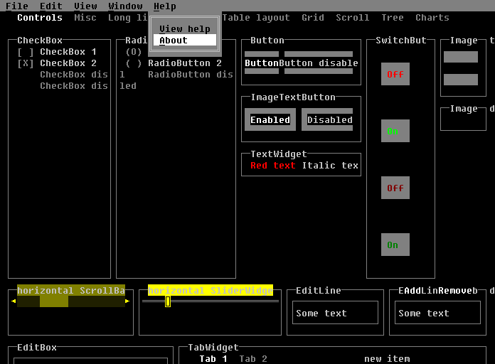

# dlangui_bearlibterminal
External platform for dlangui based on Bearlib terminal

## Usage
Just replace dependency of "dlangui" to "dlangui_bearlibterminal" in your project and compile it as usual.
